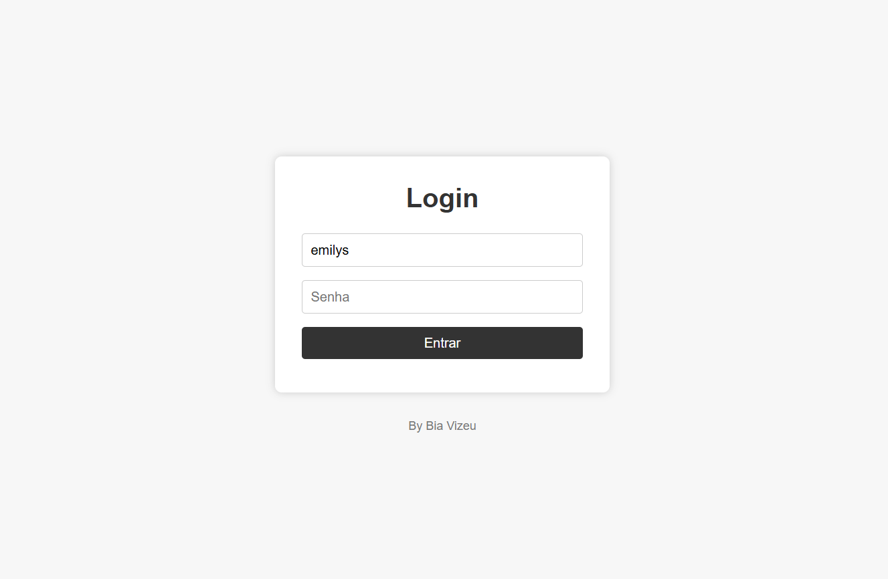
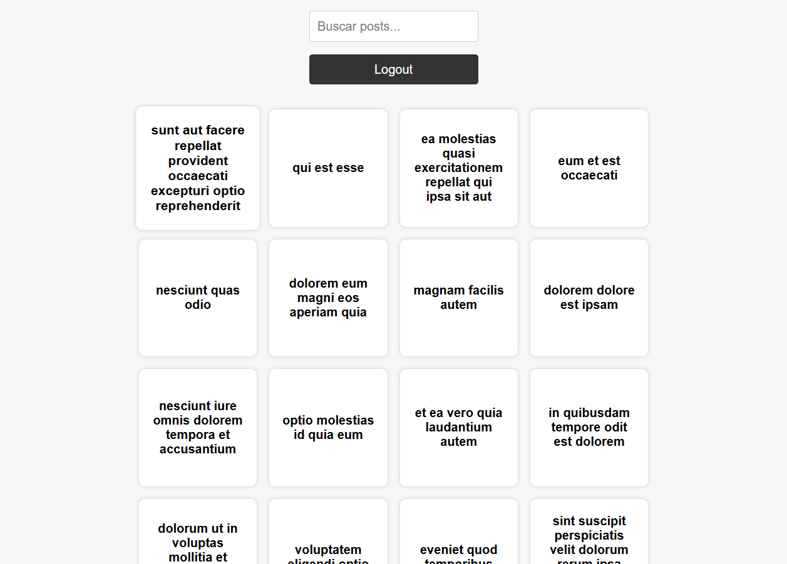
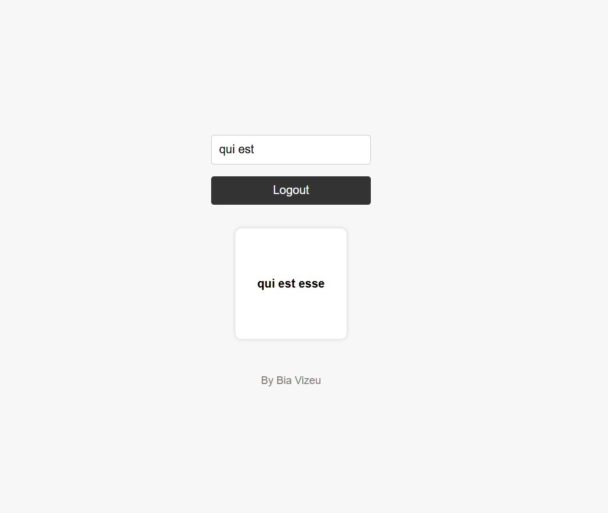
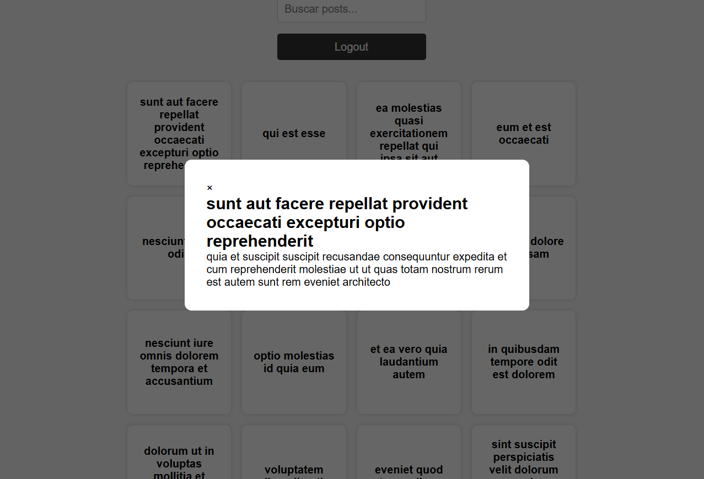

# Desafio Front-end - Nível Jr

## Prints

## Objetivo

O objetivo deste desafio é avaliar suas habilidades em desenvolvimento de páginas web front-end. Você deverá criar uma UI simples que consome uma API pública, exibe os dados em uma lista, permite a navegação para uma tela de detalhes e possui uma funcionalidade de busca.

## Funcionalidades

### 1. Tela de Login

- Crie uma tela de login com campos para usuário e senha.
- Utilize a API [DummyJSON](https://dummyjson.com/docs/auth) para autenticar o usuário. A rota de autenticação é `https://dummyjson.com/auth/login`.
- As credenciais do usuário devem ser armazenadas de forma segura no dispositivo (por exemplo, usando LocalStorage) para que o usuário permaneça logado ao entrar na página junto com a estratégia de refreshtoken quando o token do usuário expirar.
- Adicione uma funcionalidade de logout.

### 2. Tela de Listagem de Posts

- Após o login, a primeira tela deve exibir uma lista de posts em forma de cards.
- Cada item da lista deve exibir o título do post.
- Os dados dos posts devem ser obtidos da rota `/posts` da API do JSONPlaceholder.

### 3. Tela de Detalhes do Post

- Ao tocar em um item da lista, o usuário deve ser redirecionado para um modal de detalhes do post.
- O modal de detalhes deve exibir o título e o corpo do post.
- Os dados do post podem ser passados da tela de listagem ou obtidos da rota `/posts/:id` da API.

### 4. Funcionalidade de Busca

- Na tela de listagem, adicione um campo de busca para filtrar os posts pelo título.
- A busca deve ser realizada em tempo real, à medida que o usuário digita.

### 5. Responsividade UX

- A interface deve ser responsiva e funcionar bem em dispositivos móveis e desktops.
- Utilize boas práticas de design responsivo, como media queries e flexbox ou grid layout.

## Bia Vizeu
